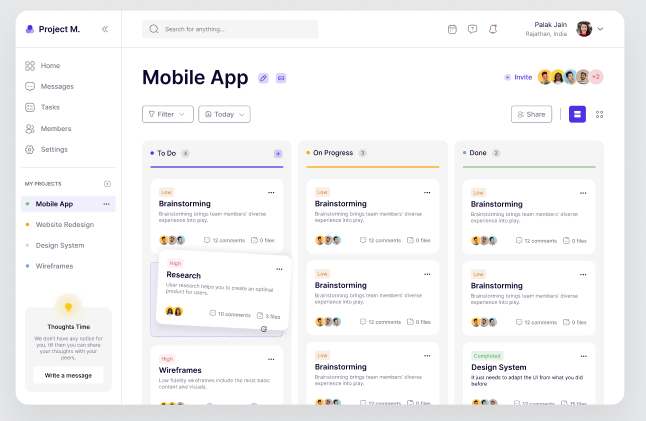

# Kanban Task Management App

This project is a **Kanban Task Management App** built using **React** and **Vite**. The app provides an intuitive user interface for managing tasks, leveraging **MUI** for components and **Tailwind CSS** for styling.

## Features

- **Task Management**: Create, update, and delete tasks.
- **Drag and Drop**: Reorganize tasks across columns.
- **Responsive Design**: Optimized for both desktop and mobile devices.
- **Customizable UI**: Styled using MUI and Tailwind CSS for flexibility.

## Technologies Used

- **React**: Frontend library for building user interfaces.
- **Vite**: Fast build tool for modern web projects.
- **MUI**: Component library for consistent UI design.
- **Tailwind CSS**: Utility-first CSS framework for styling.

## Installation

1. Clone the repository:

   ```bash
   git clone https://github.com/your-username/kanban-task-app.git
   cd kanban-task-app
   ```

2. Install dependencies:

   ```bash
   npm install
   ```

3. Start the development server:

   ```bash
   npm run dev
   ```

4. Open the app in your browser at `http://localhost:5173`.

## Folder Structure

```
/public
  └── screenshot.png  # Add your app screenshot here
/src
  ├── components      # Reusable React components
  ├── pages           # Application pages
  ├── styles          # Tailwind CSS and custom styles
  └── App.jsx         # Main application file
```

## Adding a Screenshot

```markdown
## Screenshot


```

## Expanding the ESLint Configuration

For production applications, consider using TypeScript with type-aware lint rules. Refer to the [TS template](https://github.com/vitejs/vite/tree/main/packages/create-vite/template-react-ts) for guidance on integrating TypeScript and [`typescript-eslint`](https://typescript-eslint.io).

## License

This project is licensed under the [MIT License](LICENSE).

## Acknowledgments

- [Vite](https://vitejs.dev/)
- [React](https://reactjs.org/)
- [MUI](https://mui.com/)
- [Tailwind CSS](https://tailwindcss.com/)
- [React DnD](https://react-dnd.github.io/react-dnd/about)

Feel free to contribute to this project by submitting issues or pull requests!
